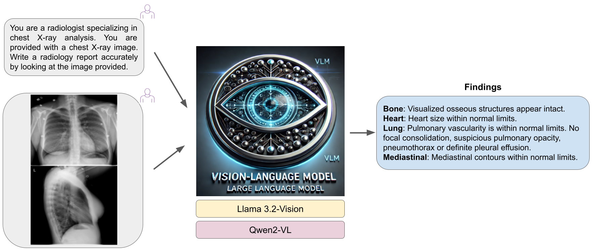
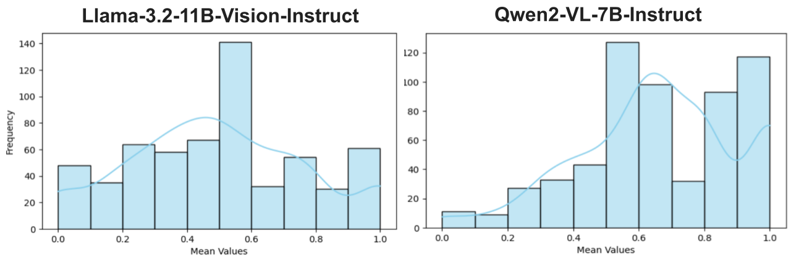

## Transformers Using Multi-Modal Image and Text Data to Predict Radiology Reports for X-ray Images

I trained (fine-tuned) a multi-modal LLM model to predict the findings on X-ray images to help radiologists in their day-to-day work. 
The present global shortage of radiologists limits access to specialist care and imposes heavy workloads on radiologists, leading to unwanted delays and errors in clinical decisions.
This model can automate X-ray report generation, enhance diagnostic accuracy, and facilitate clinicians in providing timely and effective patient care.

Unfortunately, generating radiology reports remains an unsolved challenge. Here, I present an approach to tackle this challenge and showcase the use of Vision-Language LLM to predict radiology reports. The model inputs multi-modal image and text data and provides an X-ray report. I use the Llama 3.2-Vision and Qwen2-VL models and fine-tune them on the 2900+ chest X-ray images from the public [IU X-Ray dataset](https://paperswithcode.com/dataset/iu-x-ray). 

  

For the model performance evaluation of the clinical quality of artificial intelligence (AI)-generated reports, I use the GREEN (Generative Radiology Report Evaluation and Error Notation) metric. 
It utilizes language models to identify and explain clinically significant errors in radiology reports. 
Other evaluation metrics can also be used, but they either fail to consider factual correctness, such as BLEU and ROUGE or have limited interpretability, like F1CheXpert and F1RadGraph ([Ostmeier et al., 2024](https://stanford-aimi.github.io/green.html)).
I get the following distribution of GREEN scores evaluated on the per report sample image: 

  

This is an ongoing project. 

- Train (fine-tuning) Llama 3.2-Vision model on X-ray data and reports
`task2_llama_train.ipynb` 
- Performance evaluation of the Llama 3.2-Vision model - task2_llama_eval.ipynb 
- Train (fine-tuning) Qwen2-VL - task2_qwen_train.ipynb 
- Performance evaluation of the Qwen2-VL model - task2_qwen_eval.ipynb 

